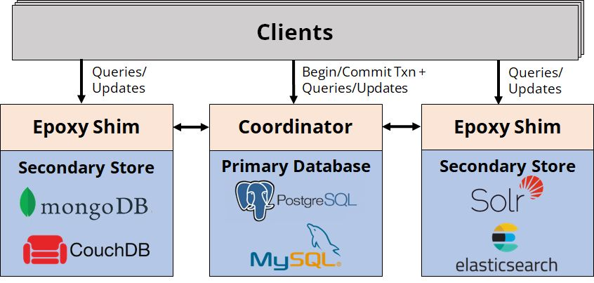
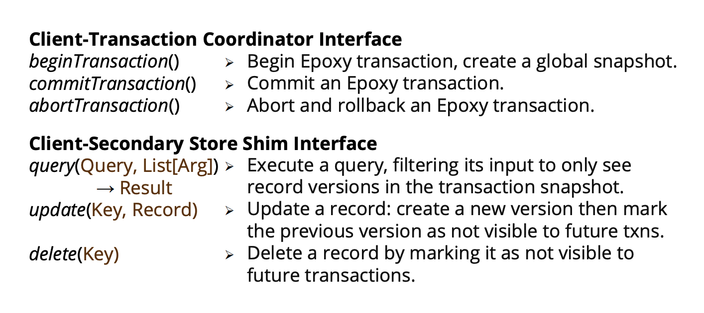
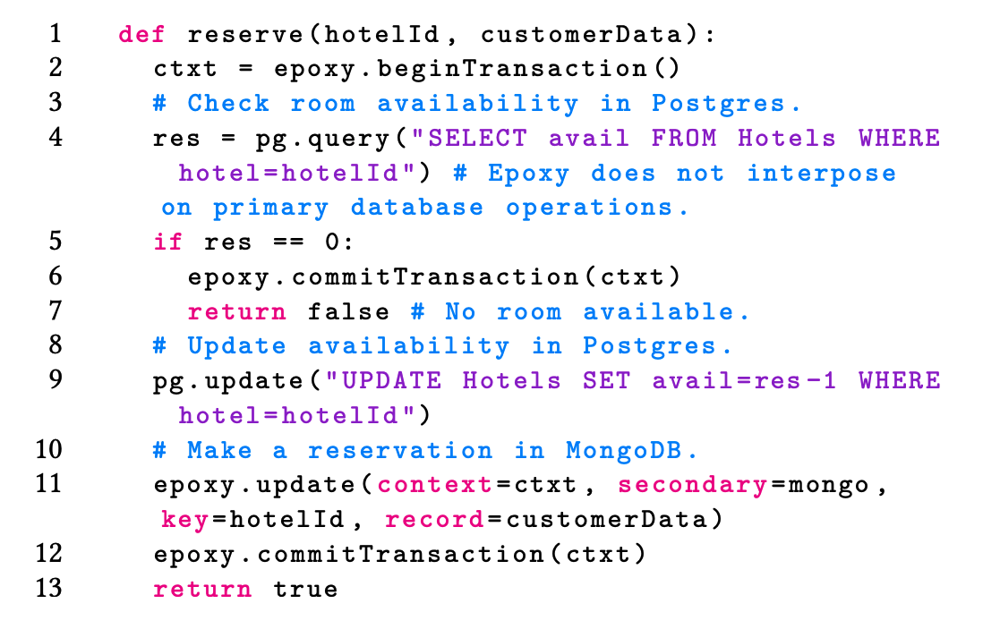
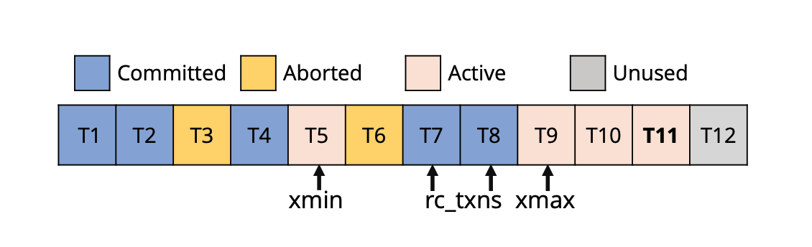
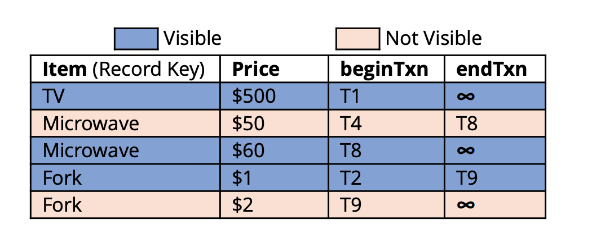
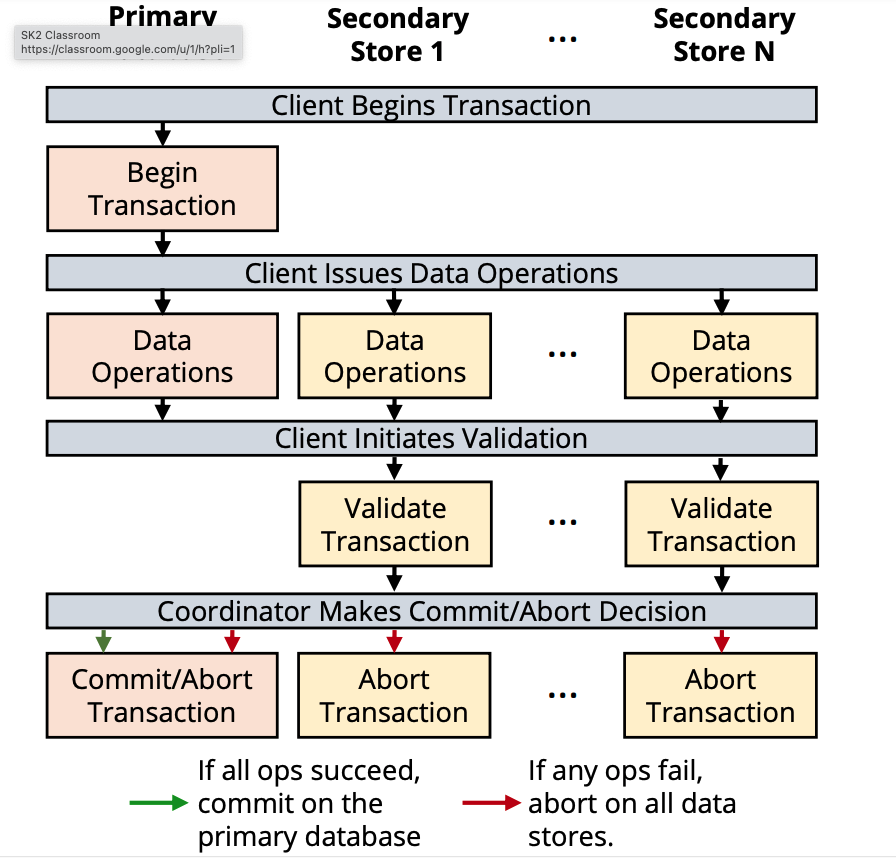

+++
title = 'Epoxy: ACID Transactions Across Diverse Data Stores'
date = 2023-12-20T11:06:35+08:00
draft = true
+++

## Introduction
一個線上商店可能會在 Postgres 中處理客戶交易，但在 Elasticsearch 中存儲商品數據以實現快速搜索，並在 S3 中存儲圖片以節省存儲成本；這些專門系統對於此類任務比關係型數據庫(RDBMS)更有效。

## Objective
* Heterogenous Transaction (RDBMS, Dociment, Object Store...)
    * MVCC 的方式管理 Heterogenous Txn 
    * 只需要有 Durable Write 的 Data Source 即可，不需要手動實作 2PC
    * 實作 < 1K LOC: Postgres, Elasticsearch, MongoDB, Google Cloud Storage, MySQL
    * Overhead (TPC-C, Micro-service workload)
        * Read-mostly: 10%
        * Write-heavy: 72%
    * Require
        * Exclusive mode -> Accessing Table
        * Durable Write
## Compare to History
    * 教科書做法: X/Open XA
        缺點: 很多都不支援 2PC，例如: MongoDB, CockroachDB, and Redis
    * 先前的作法: Cherry Garcia
        缺點: Heterogenous 有 ACID 但只限於 Key-Value Operation
    * 先前的作法: Skeena
        缺點: 假設要在 share-memory 的條件下

## Concept
### Architecture

### Requirements
* Primary: Isolation LeveL > Snapshot 
* Secondary:
    * Single-object Write: Durable, Linearizable
    * Record 都有獨立的 Key
    * Exclusive mode
* Records 可以被 Metadata Filtering
    * 如果 Secondary Store 不支援，不是說不能做到，只是暗示了每一次都需要去 Primary 拿資料，Overhead 高到不切實際
### Interface & Example

### Epoxy Protocol
#### Snapshot

* xmin
* xmax
* rc_txns
#### Record Metadata

* beginTxn
* endTxn

#### Epoxy Transactions

1. Begin Transaction
2. Data Operations
3. Validation
4. Commit or Abort Transaction
5. Optimizing Read-Only Transactions

### Evaluation
####  Baseline
* No Txns
* XA-Based Txn Manager

#### Workload
* Multi-DBMS TPC-C
* Hotel
* Cart
* Profile
* Many-Data Store Benchmark

## Reference
1. [How to Get Transactions Between (Almost) Any Data Stores](https://petereliaskraft.net/blog/epoxy)
2. [Epoxy: ACID Transactions Across Diverse Data Stores](https://petereliaskraft.net/res/p2732-kraft.pdf)